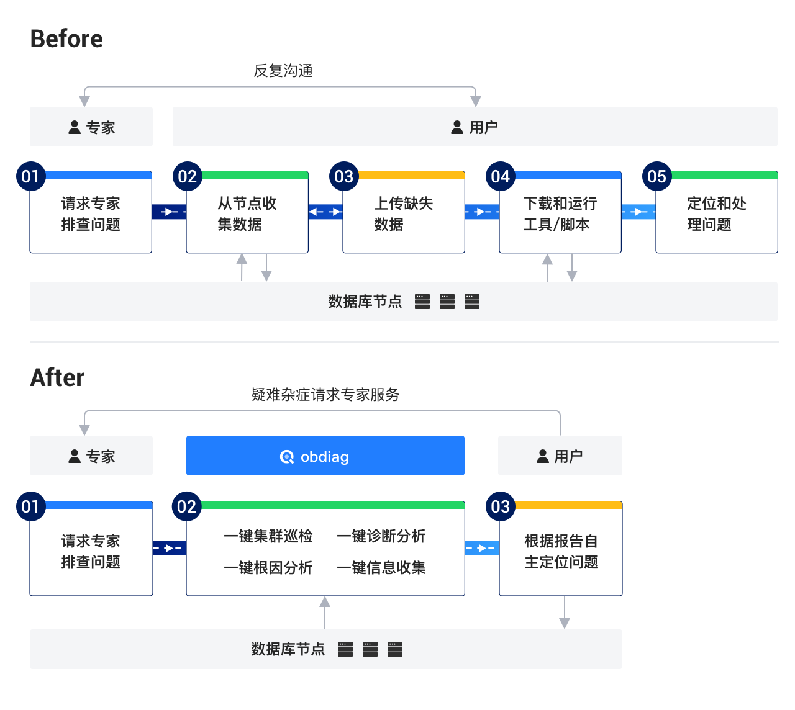

<p align="center">
    <a href="https://github.com/oceanbase/obdiag/blob/master/LICENSE">
        
    </a>
    <a href="https://github.com/oceanbase/obdiag/releases/latest">
        
    </a>
    <a href="https://img.shields.io/badge/python%20-3.8.0%2B-blue.svg">
        
    </a>
    <a href="https://github.com/oceanbase/obdiag">
        
    </a>
    <a href="https://github.com/oceanbase/obdiag">
        
    </a>
    <a href="https://www.oceanbase.com/docs/obdiag-cn">
        
    </a>
</p>

# OceanBase Diagnostic Tool (obdiag)

## 简介
OceanBase Diagnostic Tool (obdiag) 是一款专门OceanBase打造的敏捷诊断工具，功能包括诊断信息收集、分析、巡检，可以在OceanBase集群不同的部署模式下（OCP，OBD或用户根据文档手工部署）实现一键执行。

## 项目价值 & 愿景



# 安装 obdiag

可通过如下方式安装obdiag

## 方式一: 通过rpm包安装
```shell script
sudo yum install -y yum-utils
sudo yum-config-manager --add-repo https://mirrors.aliyun.com/oceanbase/OceanBase.repo
sudo yum install -y oceanbase-diagnostic-tool
sh /usr/local/oceanbase-diagnostic-tool/init.sh
```

## 方式二：源码安装
源码安装需要在python >= 3.8的环境下进行

```shell
pip3 install -r requirements3.txt
sh dev_init.sh
source ~/.bashrc
```

# obdiag config
配置文件的默认路径是`~/.obdiag/config.yml` . 可直接编辑配置文件或者通过`obdiag config <option>` 命令快速生成配置
```shell script
obdiag config -h <db_host> -u <sys_user> [-p password] [-P port]
```

# obdiag 功能
- 一键集群巡检
- 一键诊断分析
- 一键根因分析
- 一键信息采集


# 参与贡献

obdiag 期望构建一个开放的社区，我们欢迎任何形式的贡献，您可以：
- 通过 [Issues](https://github.com/oceanbase/obdiag/issues) 提交 bug。
- 通过 [Discussion](https://github.com/oceanbase/obdiag/discussions) 参与或发起讨论。
- 通过 [Pull requests](https://github.com/oceanbase/obdiag/pulls) 提交问题修复或者功能特性。

# Roadmap Ahead

| 版本 | 迭代周期 |发布日期| 功能点 | 
|---------|--------|-------|---------|
|1.6.0| 2024.01|2024.01.31| <ul><li> 场景化信息采集 </li><li> 场景化根因分析 </li></ul> |
|2.0.0|2024.03| 2024.04.11|<ul><li> context改造，场景化扩展能力增强 </li><li> 支持在线更新巡检、采集的task </li><li> 根因分析二期 </li></ul>|
|2.1.0|2024.04| 2024.05.13|<ul><li> 根因分析场景扩展 </li><li> 新增 ash 报告 采集 </li></ul>|
|2.2.0|2024.05| - |<ul><li> 根因分析场景扩展 </li></ul>|
|2.3.0|2024.06| - |<ul><li> 根因分析场景扩展 </li><li> 支持 SQL 诊断 </li></ul>|
|2.4.0|2024.07| - |<ul><li> 根因分析场景扩展 </li><li> 适配两款内核的诊断工具 </li></ul>|
|2.5.0|2024.08| - |<ul><li> 根因分析场景扩展 </li><li> 支持 OMS 诊断 </li></ul>|
|3.0.0|2024.09| - |<ul><li> 根因分析场景扩展 </li><li> 服务化改造 </li></ul>|
|3.1.0|2024.10| - |<ul><li> 根因分析场景扩展 </li><li> 支持巡检报告比对 </li></ul>|
|3.2.0|2024.11| - |<ul><li> 根因分析场景扩展 </li><li> SQL 诊断二期，支持SQL问题的根因分析 </li></ul>|
|3.3.0|2024.12| - |<ul><li> AI 化探索 </li></ul>|


# 许可证

OceanBase Diagnostic Tool 使用 [MulanPSL - 2.0](http://license.coscl.org.cn/MulanPSL2) 许可证。
您可以免费复制及使用源代码。当您修改或分发源代码时，请遵守木兰协议。

# 支持

如果您在使用 OceanBase LogProxy 时遇到任何问题，欢迎联系我们寻求帮助：

- [GitHub Issue](https://github.com/oceanbase/obdiag/issues)
- [官方网站](https://www.oceanbase.com/docs/obdiag-cn)

# 加入我们
请添加 OB社区小助手（微信号：obce666）并备注“obdiag SIG”，工作人员会联系并指引您加入 SIG 的相关事宜。期待您的积极参与与宝贵贡献！