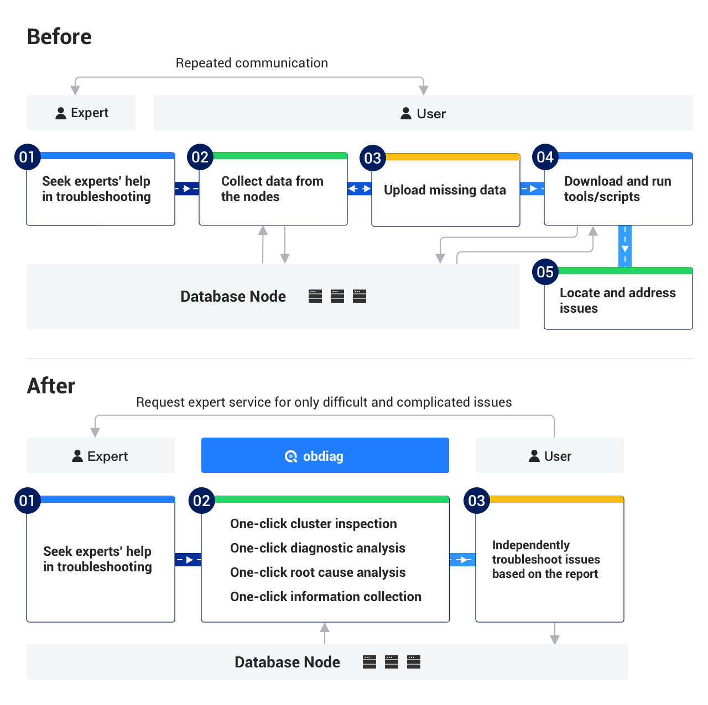

English | [中文版](README-CN.md)

<p align="center">
    <a href="https://github.com/oceanbase/obdiag/blob/master/LICENSE">
        
    </a>
    <a href="https://github.com/oceanbase/obdiag/releases/latest">
        
    </a>
    <a href="https://img.shields.io/badge/python%20-3.8.0%2B-blue.svg">
        
    </a>
    <a href="https://github.com/oceanbase/obdiag">
        
    </a>
    <a href="https://github.com/oceanbase/obdiag">
        
    </a>
    <a href="https://www.oceanbase.com/docs/obdiag-cn">
        
    </a>
</p>

# OceanBase Diagnostic Tool (obdiag)

## Overview
OceanBase Diagnostic Tool (obdiag) is a quick diagnostic tool for open-source OceanBase software. The features include gather\analyze\check OceanBase Diagnostic information. It can be executed with one click in different deployment modes of OceanBase clusters (OCP, OBD, or manually deployed by users according to documentation).

## Project Value & Vision


# Install obdiag
You can install obdiag by using these methods:

## Method 1: Install obdiag by using RPM packages
```shell script
sudo yum install -y yum-utils
sudo yum-config-manager --add-repo https://mirrors.aliyun.com/oceanbase/OceanBase.repo
sudo yum install -y oceanbase-diagnostic-tool
sh /usr/local/oceanbase-diagnostic-tool/init.sh
```

## Method 2: Install obdiag by using the source code
To install obdiag on Python >= 3.8, run these commands:

```shell
pip3 install -r requirements3.txt
sh dev_init.sh
source ~/.bashrc
```

# obdiag config
The path of the configuration file for the diagnosed cluster is stored in `~/.obdiag/config.yml` .You can directly edit the configuration file or generate the configuration file through the `obdiag config <option>` command
```shell script
obdiag config -h <db_host> -u <sys_user> [-p password] [-P port]
```

# obdiag Fuctions
- One-click cluster inspection
- One-click diagnostic analyze
- One-click root cause analysis
- One-click information collection

For more details, please refer to [Official docs](https://www.oceanbase.com/docs/obdiag-cn)

# Join the Contributing Community

obdiag envisions an open community. We welcome your contributions in any form:

- Report bugs through [Issues](https://github.com/oceanbase/obdiag/issues).
- Participate in or initiate discussions via [Discussion](https://github.com/oceanbase/obdiag/discussions).
- Contribute bug fixes or new features through [Pull requests](https://github.com/oceanbase/obdiag/pulls).


# Roadmap Ahead

| Version | Iteration Period | Release Date | Function | 
|---------|--------|-------|---------|
|1.6.0| 2024.01| 2024.01.31| <ul><li> Scenario based fault information collection </li><li> Scenario based root cause analysis </li></ul> |
|2.0.0|2024.03| 2024.04.11| <ul><li> Context Transformation, Enhanced Scene Expansion Capabilities</li><li> Support online updating of inspection and gather tasks </li><li>Root Cause Analysis Phase II Transformation </li></ul>|
|2.1.0|2024.04| 2024.05.13| <ul><li> Root Cause Analysis Scenario Expansion </li><li> Gather ash report </li></ul>|
|2.2.0|2024.05| - |<ul><li> Root Cause Analysis Scenario Expansion </li></ul>|
|2.3.0|2024.06| - |<ul><li> Root Cause Analysis Scenario Expansion </li><li> Support SQL Diagnosis </li></ul>|
|2.4.0|2024.07| - |<ul><li> Root Cause Analysis Scenario Expansion </li><li> Adapting Two Additional Kernel Diagnostic Tools </li></ul>|
|2.5.0|2024.08| - |<ul><li> Root Cause Analysis Scenario Expansion </li><li> Support OMS Diagnosis </li></ul>|
|3.0.0|2024.09| - |<ul><li> Root Cause Analysis Scenario Expansion </li><li> Service-ification Transformation </li></ul>|
|3.1.0|2024.10| - |<ul><li> Root Cause Analysis Scenario Expansion </li><li> Supporting Comparative Functionality for Patrol Inspection Reports </li></ul>|
|3.2.0|2024.11| - |<ul><li> Root Cause Analysis Scenario Expansion </li><li> SQL Diagnosis Phase II, Supporting Root Cause Analysis for SQL problems </li></ul>|
|3.3.0|2024.12| - |<ul><li> AI for obdiag </li></ul>|

# Licencing
OceanBase Database is under MulanPubL - 2.0 license. You can freely copy and use the source code. When you modify or
distribute the source code, please obey the MulanPubL - 2.0 license.

# Support

In case you have any problems when using obdiag, welcome reach out for help:

- [GitHub Issue](https://github.com/oceanbase/obdiag/issues)
- [Official Website](https://www.oceanbase.com/docs/obdiag-cn)

# Join us
Please add the OB community assistant (WeChat ID: obce666) and note "obdiag SIG", and the staff will contact you and guide you on matters related to joining SIG. We look forward to your active participation and valuable contributions!

