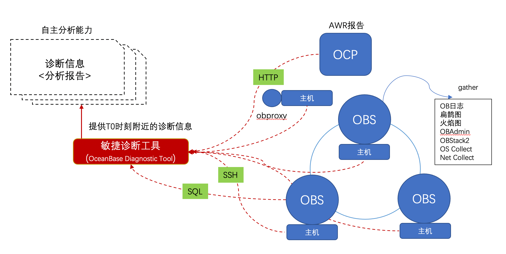

# Oceanbase Diagnostic Tool
OceanBase诊断工具(OceanBase Diagnostic Tool) 是 OceanBase 的黑屏诊断工具。目前包含了对于OceanBase日志、SQL Audit以及OceanBase进程堆栈等信息进行的扫描、收集、分析，可以在OceanBase集群不同的部署模式下（OCP，OBD或用户根据文档手工部署）实现一键执行。



# 编译部署说明：
## 编译环境要求
- 执行环境: python >= 3.6.5 或者python > 2.7.5

```shell script
# 下载源代码
git clone https://github.com/oceanbase/oceanbase-diagnostic-tool.git

# 编译(编译过程是拉取python依赖包放到编译目录下)
cd oceanbase-diagnostic-tool && sh ./build/build.sh

# 编译后会在./build/生成一个tar.gz的包
cd ./build/
ls
oceanbase-diagnostic-tool-1.3.0-yyyyMMddHHmmss.tar.gz

```
## 使用环境要求
- 环境依赖：支持zip命令
 将上边编译的包解压或者直接从https://github.com/oceanbase/oceanbase-diagnostic-tool/releases 下载包解压，进入解压后的文件即可使用obdiag提供的各项功能

```shell script
tar zxvf oceanbase-diagnostic-tool-1.4.0-yyyyMMddHHmmss.tar.gz

cd oceanbase-diagnostic-tool && source init.sh

```

# 参数配置说明：
## 参数配置
所有的配置都在conf目录下的config.yml中:

```yaml
# 配置一：这部分的配置是OBDIAG自身的一些配置，包括自身的日志输出和外置的变量等
OBDIAG:
  BASIC:
    config_backup_dir: /tmp/oceanbase-diagnostic-tool/conf # 配置文件快速生成的时候会覆写config.yml，为了让用户可查到上一次的配置，每次执行配置更新的时候会保存一份
    file_number_limit: 20 # 收集observer的日志的时候单机限制回传的最大文件数量
    file_size_limit: 2G # 收集observer的日志的时候单机限制回传的最大文件大小
  LOGGER: # OBDIAG本身的日志打印相关配置
    log_dir: /tmp/oceanbase-diagnostic-tool/log # OBDIAG日志文件路径
    log_filename: obdiag.log # OBDIAG日志文件名
    file_handler_log_level: DEBUG # 输出到日志文件中的日志级别
    log_level: INFO # OBDIAG日志输出的级别
    mode: obdiag
    stdout_handler_log_level: DEBUG
# 配置二：属于OCP的配置，有OCP托管的集群可以配置上
OCP:
  LOGIN:
    url: http://xxx.xxx.xxx.xxx:xxxx
    user: xxx
    password: xxx
  METADB:
    ip: xxx.xxx.xxx.xxx
    port: xxx
    user: xxx
    password: xxx
    dbname: xxx
# 配置三：收集的集群信息
OBCLUSTER:
  cluster_name: xxx
  host: xxx.xxx.xxx.xxx
  port: xxx
  user: xxx
  password: xxx
# 配置四：收集的节点的登录信息
NODES:
- ip: xxx.xxx.xxx.xxx
  port: xxx
  user: xxx
  password: xxx
  private_key: ''
```

使用的时候需要根据实际情况配置上边的四个配置。其中OBDIAG极少修改，其他三个配置项按需修改，修改部分为"xxx"

Tips: 当有ocp的时候，你如果想要收集ocp托管下某个集群的所有所有主机的上的信息，你也可以通过./obdiag config来快速生成NODES的配置内容,使用方式如下:
```
./obdiag config -h
usage: ./obdiag config [-h] --cluster cluster_name --cluster_id cluster_id

Quick build config

optional arguments:
  -h, --help            show this help message and exit
  --cluster_name cluster_name
                        cluster name
  --cluster_id cluster_id
                        cluster id

Example: ./obdiag config --cluster_name demo1 --cluster_id xxx

```

# 功能介绍
通过 `./obdiag -h` 的命令，可以查看 Oceanbase Diagnostic Tool 的使用帮助。
```
usage: ./obdiag [-h] {config,gather} ...

Oceanbase Diagnostic Tool

positional arguments:
  {config,gather}
    config         Quick build config
    gather         Gather logs and other information

optional arguments:
  -h, --help       show this help message and exit

```

## 一键收集功能列表
- [一键收集OB日志](./docs/gather_ob_log.md)

- [一键收集AWR报告](./docs/gather_awr.md)

- [一键收集主机信息](./docs/gather_sysstat.md)

- [一键收集slog/clog日志](./docs/gather_admin.md)

- [一键收集火焰图信息](./docs/gather_perf.md)

- [一键收集并行SQL的执行详情信息](./docs/gather_sql_plan_monitor.md)

- [一键收集OBPROXY日志](./docs/gather_obproxy_log.md)

- [一键收集全部诊断信息](./docs/gather_all.md)

## 一键分析功能列表

- [一键分析OB日志](./docs/analyze_ob_log.md)


## 一键巡检功能
- [一键巡检](./docs/check.md)

## 许可证

OceanBase Diagnostic Tool 使用 [MulanPSL - 2.0](http://license.coscl.org.cn/MulanPSL2) 许可证。
您可以免费复制及使用源代码。当您修改或分发源代码时，请遵守木兰协议。

## 联系我们
钉钉群: 17920025807
